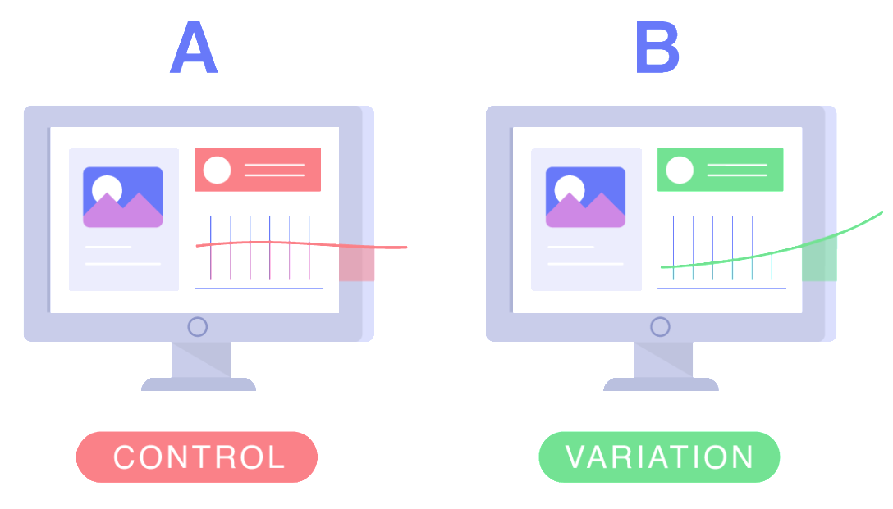

# PROJETO TESTE A/B - ELETRONIC HOUSE

[Fonte da imagem](https://blog.pareto.io/planejar-teste-ab/)

## O projeto 

Este projeto que compõe o meu portfólio profissional busca criar uma solução de negócio que auxiliará uma empresa de e-commerce a testar se a mudança de layout de uma página web é capaz melhorar as vendas de um produto.

O projeto está estruturado nos seguintes passos:

    1.  Questão de negócio
    2.  Premissas do projeto
    3.  Planejamento da solução e os produtos propostos
    4.  Escolhendo o método
    5.  Design do Experimento
    6.  Coleta e limpeza dos dados
    7.  Teste de Hipótese
    8.  Conclusão do teste
    9.  Respondendo as perguntas de negócio
    10. Conclusão do projeto de portfólio

## 1 Questão de negócio

A Electronic House é uma loja online especializada em produtos de informática para residências e escritórios. No último ano, o faturamento total da empresa foi de 16 bilhões de reais. Os clientes podem adquirir no site diversos itens, como mouses, monitores, teclados, computadores, laptops, cabos HDMI, fones de ouvido, webcams, entre outros, e recebê-los no conforto de suas casas.

Após analisar as vendas do último ano, o time de Data Analytics constatou que o tecladoASUS ROG Strix Flare II8 foi responsável por 1% de todo o faturamento. Com base no histórico, verificou-se que esse produto além de apresentar uma boa taxa de conversão também possui uma margem de lucro satisfatória. A equipe de produtos da empresa decidiu criar uma estratégia para explorar o potencial de vendas doASUS ROG Strix Flare II8. Considerando essa oportunidade de negócio, o gerente de produto solicitou à equipe de designers de UX o desenvolvimento de uma nova página de vendas, com o objetivo de aumentar a taxa de conversão desse teclado no site.

[Página oficial do produto](https://rog.asus.com/keyboards/keyboards/pbt-keycaps/rog-strix-flare-ii-model/)

### 1.1 Qual o problema de negócio?

<i> **Definição da taxa de conversão da nova página** </i>

Segundo o gerente de produto, a taxa de conversão da página atual do teclado ASUS ROG STRIX FLARE II tem sido, em média, 12% ao longo do último ano. O objetivo do product manager é aumentar a taxa de conversão em 2%, ou seja, a nova página de vendas, desenvolvida pelo time de UX, seria um sucesso se a sua taxa de conversão fosse de 14%.

<i> **Expectativas de retorno financeiro caso a página nova converta 2% a mais que a página atual** </i>

A página desse teclado teve no último ano aproximadamente 285 mil visitas.

Com base no histórico anual, a taxa de conversão desse produto foi de 12%, que corresponde a 34.200 clientes que compraram o teclado.

Se a conversão da nova página aumentar para 14% a projeção de clientes anual passaria para 39.900 .

O preço médio do teclado ASUS ROG STRIX FLARE II no ano passado foi de R$4.500,00.

Sendo assim o faturamento anual com esse produto corresponde:

Faturamento = 34.200 x R$4.500,00

Faturamento = R$153.900.000,00

Se a conversão de clientes passar para 14%, o faturamento esperado nesse cenário seria de:

Novo faturamento = 39.900 x R$4.500,00

Novo faturamento = R$179.550.000,00

Nessa simulação o aumento da conversão da página aumentaria o faturamento bruto em R$25.650.000,00. Convém mencionar que um aumento de 2% na taxa de conversão iria trazer um lift de 16,66% no faturamento do teclado.

<i> **O Problema - Minimizar os riscos da estratégia de alteração do layout** </i>

Antes de trocar a página de vendas antiga pela nova, o product manager gostaria de testar a efetividade da nova página em um grupo menor de clientes, a fim de correr menos riscos de queda da conversão, caso a página nova mostre uma conversão pior do que a página atual.

### 1.2 Proposta de solução do problema

Você foi contratado como consultor pela Electronic House para ajudar o time de Designers da nova página, a validar a sua efetividade de uma maneira mais segura, com mais confiança e rigidez na análise. A proposta é desenvolver um experimento de teste A/B entre a página atual e a nova desenvolvida pela equipe de UX.

Os entregáveis do seu trabalho são os seguintes:

1. A conversão da nova página é realmente melhor do a conversão da página atual?

2. Durante o teste qual foi o valor do faturamento total na venda do teclado bluetooth através da página antiga?

3. Durante o teste qual foi o valor do faturamento total na venda do teclado bluetooth através da nova página?

## 2 Premissas do projeto

Este projeto de portfólio foi elaborado utilizando um dataset de teste A/B disponibilizado pela plataforma Kaggle Inc. O dataset contém aproximadamente 294.500 linhas e 5 features, com informações sobre o histórico de clientes que foram divididos em dois grupos e apresentados a diferentes páginas web. Além disso, há uma feature que indica se o cliente converteu ou não a compra.

Cada linha do conjunto de dados possui as seguintes informações:

    user_id: Identificador do usuário
    timestamp: Data e hora do acesso a página
    Group: Grupo que o usuário foi separado
    landing_page: Página web que foi mostrada ao usuário
    converted: Se o usuário converteu a compra após visualizar a página

Assumiremos no projeto que os dados do dataset correspondem a atual população. Dessa forma representaria os possíveis clientes interessados e que visitam o site no ano atual. Cabe destacar que este projeto de portfólio é uma criação hipotética, baseada na experiência do autor e nos dados coletados no Kaggle. Não é possível atestar a veracidade dos dados do dataset, nem confirmar se possuem conexão com o mercado real.

## 3 Planejamento da solução e os produtos propostos

### 3.1 Produto proposto

Elaboração de um relatório respondendo as questões de negócio junto com toda a fundamentação técnica do experimento. Além disso, um arquivo [jupyter notebook](https://github.com/deivison1983/teste-a-b-eletronic-house/blob/main/notebook/pa_teste_ab_keyboard_eletronic_house.ipynb) também foi disponibilizado.

### 3.2 Ferramentas utilizadas

* Python Packages
* Jupyter notebook
* Microsoft Word

<table>
  <tbody>
    <tr valign="top">
      <td width="25%" align="center">
        Python  
        
      </td>
      <td width="25%" align="center">
        pandas  
        
      </td>
      <td width="25%" align="center">
        NumPy  
        
      </td>
      <td width="25%" align="center">
        SciPy  
        
      </td>
    </tr>
    <tr valign="top">
      <td width="25%" align="center">
        Matplotlib  
        
      </td>
      <td width="25%" align="center">
        seaborn  
        
      </td>
      <td width="25%" align="center">
        Statsmodels  
        
      </td>
      <td width="25%" align="center">
        XGBoost  
        
      </td> 
    </tr>
  </tbody>
</table>

### 3.3 Processo

O processo utilizado para resolução do problema de negócio seguiu os seguintes passos:

    1.  Escolha do método adequado para o teste A/B
    2.  Design do Experimento
    3.  Coleta, limpeza e preparação dos dados
    4.  Teste de Hipóteses
    5.  Conclusão do teste

## 4 Escolhendo o método

O teste de hipóteses é uma ferramenta estatística que permite realizar inferências sobre dois ou mais grupos selecionados por meio de um processo de amostragem. O tipo de dados nas amostras e as comparações desejadas orientam para diferentes abordagens técnicas. As comparações entre os grupos podem ser feitas tanto para dados contínuos quanto para dados discretos/categóricos.

Para este projeto, o objetivo é determinar se a nova página consegue converter uma taxa maior de clientes em comparação à página antiga, a qual já se sabe que converte 12 de cada 100 clientes que a acessam. Para isso, foi escolhido um teste para dados discretos/categóricos, focando em verificar se o cliente efetuou a compra ou não após a alteração do layout. O teste Z para diferenças entre proporções de duas amostras unicaudal pode ser utilizado para realizar essa inferência estatística.

O teste utilizou duas amostras: a amostra do grupo de controle, composta por usuários que visualizaram apenas a página antiga, e outra amostra formada por clientes que visualizaram apenas a nova página. Para garantir a independência das amostras, foi crucial excluir usuários que acessaram ambas as páginas durante o teste.

## 5 Design do Experimento

### 5.1 Formulação das Hipóteses do Experimento

<i>**Hipótese Nula**</i>

H0: $p_{1} \ge p_{2}$ : A conversão da página de controle é maior ou igual a da página nova.

* Isso significa que a proporção de conversão no grupo de controle ( 𝑝1 - página antiga )  é maior ou igual à proporção de conversão no grupo de tratamento ( p2 - página nova ).

* Em outras palavras, a nova página web (grupo de tratamento) não tem uma taxa de conversão maior do que a página original (grupo de controle).

<i>**Hipótese Alternativa**</i>

H1: $p_{1} < p_{2}$ : A conversão da página de controle é menor a da página de tratamento.

* Isso significa que a proporção de conversão no grupo de controle ( 𝑝1 - página antiga ) é menor do que a proporção de conversão no grupo de tratamento ( 𝑝2 - página nova ).

* Em outras palavras, a nova página web (grupo de tratamento) tem uma taxa de conversão maior do que a página original (grupo de controle).

### 5.2 Escolha do tipo de teste

O tipo de teste adequado a resolução do problema:

* Teste Z de diferença entre proporções para duas amostras

### 5.3 Definição dos parâmetros do teste

    Intervalo de confiança: 95%

    Nível de significância: 5%

    Potência do teste: 80 %

    Tamanho do efeito - Quanto se espera que a nova página seja melhor que página atual:
      
      P1 página atual: 0.12
      P2 página nova : 0.14

Com os parâmetros previamente definidos, o tamanho mínimo das amostras foi calculado para determinar se há um efeito significativo entre os grupos de controle e tratamento. Considerando que ambos os grupos possuem o mesmo tamanho, a amostra necessária para cada um deles foi calculada em 3.492 observações. Esse tamanho amostral é suficiente para detectar se há ou não uma diferença estatisticamente significativa nas taxas de conversão entre a página atual e a nova.

## 6 Coleta, limpeza e preparção dos dados

### 6.1 Coleta dos dados

A equipe de desenvolvimento da Electronic House realizou um teste A/B com os usuários que acessaram o site do teclado ASUS ROG STRIX FLARE II. Os resultados das conversões das páginas de controle e de tratamento foram disponibilizados em um arquivo no formato .csv.

Convém mencionar que, neste projeto, não foi planejado o tempo mínimo necessário para a execução do teste A/B, considerando o tamanho mínimo das amostras dos grupos. Cabe destacar novamente que este projeto de portfólio é uma criação hipotética, baseada na experiência do autor e nos dados disponibilizados no Kaggle. Ressalta-se, ainda, que os registros dessa base correspondem a uma população simulada, da qual são extraídas as amostras para a realização do experimento de teste A/B do projeto.

Durante o planejamento do experimento, é importante avaliar se a realização do teste é economicamente viável e se a duração do teste está dentro da janela temporal adequada para que a equipe de negócios possa decidir pela implementação da nova página para todos os usuários do site. Outro aspecto crucial a ser considerado é a presença de sazonalidade semanal, mensal ou anual no comportamento de compra dos usuários, para que o processo de coleta consiga capturar esses padrões sazonais.

### 6.2 Criar/definir a variável da bandeira A/B

No arquivo .csv, a variável de interesse "converted" já está presente, indicando se houve conversão em compra após o acesso à página. Além disso, os grupos estão devidamente identificados pela variável "group".

### 6.3 Verificação da independência dos grupos

O dataset do projeto contém um total de 294.478 linhas. Nessa base de dados, foram identificados 3.894 clientes que visualizaram as duas páginas durante a execução do teste. Ressalta-se que esses clientes, que violaram a condição de independência das amostras, foram removidos da base antes da realização do processo de amostragem aleatória. Após a remoção, verificou-se que 286.690 clientes estavam disponíveis para o processo de amostragem.

Convém mencionar novamente que os registros dessa base correspondem a uma população simulada, da qual são retiradas as amostras para a realização do experimento do teste.

### 6.4 Verificação das demais variáveis

Também foi realizada uma conferência das demais variáveis, garantindo que os registros da base estão adequados antes do processo de amostragem aleatória.

### 6.5 Amostragem e taxas de conversão dos grupos

O processo de amostragem realizado foi aleatório sem reposição das observações.

**Cálculo das taxas de conversão dos grupos amostrados:**

Taxa = Nº de conversões / Total de clientes da amostra do grupo

**Grupo controle**

Taxa controle = 412 conversões / 3492 total de clientes da amostra

Taxa controle = 0.1180

**Grupo de tratamento**

Taxa tratamento = 411 conversões / 3492 total de clientes da amostra

Taxa tratamento = 0.1177

## 7 Teste de Hipóteses

<i>**Realização da inferência estatística**</i>

Teste z de diferença entre proporções para duas amostras.

$z=\frac{(\hat{p}_{2}-\hat{p}_{1})-(p2-p1)}{\sqrt{\bar{p}*\bar{q}*(\frac{1}{n_{1}}+\frac{1}{n_{2}})}}$

$z=\frac{(aa)}{(\sqrt{ \bar{p}*\bar{q}  * ( \frac{1}{ n_{1} } + \frac{1}{ n_{2} } ) })}$

$\sqrt{ \bar{p}*\bar{q}  * ( \frac{1}{ n_{1} } + \frac{1}{ n_{2} } ) }$

<i>**Verificar se a diferença entre as taxas de conversões é estatisticamente significativa.**</i>

Cálculo da estatística do teste e do p-valor:

    Estatística z do teste: -0.037

    p-valor: 0.515

## 8 Conclusão do teste

<i>**Recapitulando as hipóteses**</i>

H0: $p_{1} \ge p_{2}$ : A conversão da página de controle é maior ou igual a da página nova.

H1: $p_{1} < p_{2}$ : A conversão da página de controle é menor que a da página de tratamento.

<i>**Interpretação e tomada de decisão**</i>

Se o p-valor < 0.05: Rejeita a H0

Se o p-valor > 0.05: Não rejeita H0

Resultado do teste

0.515 > 0.05: Não rejeita a hipótese nula.

<i>**Interpretação da decisão no contexto da afirmação original das hipóteses**</i>

Não há evidências suficientes para afirmar que a nova página web tem uma taxa de conversão maior.

Com esse tamanho de amostra e com esse tamanho do efeito esperado não foi possível afirmar que a nova página tem um desempenho melhor que a atual.

## 9 Respondendo às perguntas de negócio

**1. A conversão da nova página é realmente melhor do a conversão da página atual?**

Não se pode afirmar que a nova página web tem uma taxa de conversão maior.

**2. Durante o teste qual foi o valor do faturamento total na venda do teclado bluetooth através da página antiga?**

Faturamento página controle = 412 conversões * R$4500,00

Faturamento página controle = R$ 1.854.000,00

**3. Durante o teste qual foi o valor do faturamento total na venda do teclado bluetooth através da nova página?**

Faturamento página nova = 411 conversões * R$4500,00

Faturamento página nova = R$ 1.849.500,00

## 10 Conclusão do projeto de portfólio
Após o desenvolvimento do projeto, foi possível alcançar os objetivos desejados. O teste A/B planejado auxiliou na tomada de decisão sobre se o novo layout da página de vendas do teclado ASUS ROG STRIX FLARE II seria capaz de aumentar as vendas em 2%. Além disso, o [notebook](https://github.com/deivison1983/teste-a-b-eletronic-house/blob/main/notebook/pa_teste_ab_keyboard_eletronic_house.ipynb) contendo todo o processo de construção da solução também está disponível no presente repositório. Vale destacar que o uso da técnica de teste A/B é uma poderosa ferramenta estatística no contexto da resolução de problemas de negócio envolvendo ciência de dados.

[Notebook do projeto](https://github.com/deivison1983/teste-a-b-eletronic-house/blob/main/notebook/pa_teste_ab_keyboard_eletronic_house.ipynb)

### Autor

Deivison Morais. Visite o meu portfólio de projetos [aqui.](https://deivison1983.github.io/portfolio_projetos/)

### Contatos

  
  

